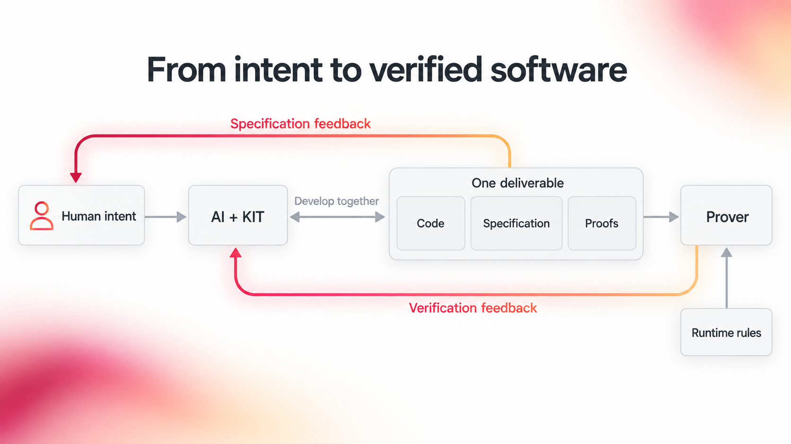

# From intent to verified software

The Formal Verification Kit helps AI produce software with evidence that it does what people intend. The aim is a coherent deliverable: **code, a precise specification of its behavior, and machine-checked proofs**, developed together. People review the specification against their intent. The prover checks whether the code satisfies that specification under the stated runtime rules and assumptions.

This repository measures one part of that vision: using the kit to recover specifications and obtain proofs for **existing code**. The archived experiments do not yet measure joint generation from intent. They give us a concrete starting point for measuring how much work AI can complete, what still needs specification feedback, and how quickly a revised deliverable can be checked.

## Why smart contracts?

Smart contracts are a demanding case study: software can control assets, and mistakes can be costly. Runtime Verification's earlier work also gives us reference specifications against which to compare new results. The case study uses the Ethereum Virtual Machine, the runtime that executes these programs. Its precise execution rules give the prover a shared basis for checking claims across many programs. The broader approach concerns software correctness, beyond this application domain.

The archived references give us traceable historical targets for testing how much formal work AI can complete. RV's tools have advanced since those specifications were written: [Kontrol accepts formal specifications as Solidity tests in Foundry](https://docs.runtimeverification.com/kontrol), and RV uses that workflow in its [current verification services](https://runtimeverification.com/smartcontract). The experiments here concern the historical targets; a comparison with current Kontrol workflows and harder contemporary projects remains to be measured.

## First pass and feedback pass

The first pass below uses one selected initial run for every target. AI could revise its own work and call the prover during that run. The second pass is reserved for a **new run after a person reviews the specification and supplies feedback**. After reviewing the incomplete results, a person directed the agent to finish the missing DSToken `transfer` proof. The after-feedback columns carry forward the other completed targets; they do not represent new runs for every target.

| Case study | First pass: function targets with complete candidate proofs | First pass: all claims checked | After human specification feedback: complete function targets | After feedback: all claims checked | Estimated AI cost |
| --- | ---: | ---: | ---: | ---: | ---: |
| HKG | 6 / 6 | 15 / 15 | 6 / 6 | 15 / 15 | $81.46 |
| DSToken | 5 / 6 | 18 / 28 | 6 / 6 | 28 / 28 | $77.26 |
| DSValue | 2 / 2 | 5 / 5 | 2 / 2 | 5 / 5 | $7.05 |
| storagevar00 | 1 / 1 | 2 / 2 | 1 / 1 | 2 / 2 | $6.18 |
| **Total** | **14 / 15** | **40 / 50** | **15 / 15** | **50 / 50** | **$171.95** |

Within the first-pass totals, target claims were **39 / 44** checked, including **17 / 22** for DSToken; auxiliary proof claims were **1 / 6** checked. Complete candidate packages: **13 / 14** jobs.

Both claim columns include target and auxiliary claims. After the targeted follow-up, DSToken has **22 / 22** target claims and **6 / 6** auxiliary `transfer` claims proved. Across the 14 packages in this four-case measurement, all **50 / 50** claims are proved, with passing independent KIT audits.

**How to read the counts.** A function target is complete when the retained candidate package has a complete machine-checked proof for its stated claims. A target claim is one labeled statement about the requested behavior; auxiliary claims support the proof and are counted separately. These numbers measure the submitted specifications, not complete coverage of a contract or acceptance of the intended requirements. HKG includes a requested `totalSupply()` interface behavior whose correct outcome is rejection because that getter is absent. DSValue's two functions share one run.

Estimated AI cost covers the selected initial runs, based on their recorded token use; it does not include the targeted follow-up. [Metrics](METRICS.md) gives the token counts and measurement scope.

A proof checks the statement that was written. A person still needs to decide whether that statement captures the intended behavior and covers the right situations.

## Evidence and next measurements

- [HKG proof packages](proofs/hkg/): six selected first-pass targets, their 15 checked candidate claims, and the published specifications and proofs.
- [Optimism L1 pausability](proofs/optimism-pause/): six proved paused-operation functions, withdrawal-proof arrays of lengths 0–10, and four proved pause-dependency functions under their stated conditions.
- [Verification status](STATUS.md): each selected function, its proof result, and its independent KIT audit.
- [Counting and cost](METRICS.md): claim counts, aggregate measurements, token use, and the AI-cost estimate.
- [Initial-pass results](#first-pass-and-feedback-pass): the selected targets and their checked claims.
- [Completed DSToken `transfer` proof](proofs/dstoken/transfer/): the specification, proof, scope, and independent audit for the initially incomplete target.

The project team estimates **more than 10× lower verification time and cost** against the historical workflow used for these reference projects, with specifications written by hand. The underlying manual baseline figures are not published here, and current Kontrol workflows have not been benchmarked. This estimate is separate from the proof counts and AI-cost figures above. Human-feedback effort remains unmeasured.

| Case study | Code | Specifications and scope | Proof results | Metrics |
| --- | --- | --- | --- | --- |
| HKG | [Source](proofs/hkg/allowance/contract.sol) | [Packages](proofs/hkg/) | [Status](STATUS.md) | [Metrics](METRICS.md) |
| DSToken | [Source](proofs/dstoken/allowance/contract.sol) | [Packages](proofs/dstoken/) | [Status](STATUS.md) | [Metrics](METRICS.md) |
| DSValue | [Source](proofs/dsvalue/peek-read/contract.sol) | [Package](proofs/dsvalue/peek-read/) | [Status](STATUS.md) | [Metrics](METRICS.md) |
| storagevar00 | [Source](proofs/storagevar00/execute/contract.sol) | [Package](proofs/storagevar00/execute/) | [Status](STATUS.md) | [Metrics](METRICS.md) |
| Optimism L1 pausability | [Source](proofs/optimism-pause/proveWithdrawalTransaction/contract.sol) | [Packages](proofs/optimism-pause/) | [Status](STATUS.md) | — |

### Verified functions

- **HKG:** [allowance](proofs/hkg/allowance/), [approve](proofs/hkg/approve/),
  [balanceOf](proofs/hkg/balanceOf/), [totalSupply rejection](proofs/hkg/totalSupply/),
  [transfer](proofs/hkg/transfer/), [transferFrom](proofs/hkg/transferFrom/).
- **DSToken:** [allowance](proofs/dstoken/allowance/), [approve](proofs/dstoken/approve/),
  [balanceOf](proofs/dstoken/balanceOf/), [totalSupply](proofs/dstoken/totalSupply/),
  [transfer](proofs/dstoken/transfer/), [transferFrom](proofs/dstoken/transferFrom/).
- **DSValue:** [peek and read](proofs/dsvalue/peek-read/).
- **storagevar00:** [execute](proofs/storagevar00/execute/).
- **Optimism L1 pausability:** [proveWithdrawalTransaction](proofs/optimism-pause/proveWithdrawalTransaction/), [finalizeWithdrawalTransaction](proofs/optimism-pause/finalizeWithdrawalTransaction/),
  [finalizeBridgeETH](proofs/optimism-pause/finalizeBridgeETH/), [finalizeBridgeERC20](proofs/optimism-pause/finalizeBridgeERC20/),
  [finalizeBridgeERC721](proofs/optimism-pause/finalizeBridgeERC721/), [relayMessage](proofs/optimism-pause/relayMessage/),
  [SuperchainConfig.pause](proofs/optimism-pause/superchainConfigPause/), [SuperchainConfig.isLocalOrGlobalPaused](proofs/optimism-pause/isLocalOrGlobalPaused/),
  [ETHLockbox.paused](proofs/optimism-pause/ethLockboxPaused/), [SystemConfig.paused](proofs/optimism-pause/systemConfigPaused/).

[STATUS.md](STATUS.md) lists each published proof and audit result.

## Read and reproduce the evidence

Start with a function's README to see its source, runtime excerpt, claim and
scope. Each package includes:

- `spec.k` and its helpers: the formal claims checked against EVM execution.
- `SCOPE.md`: assumptions and the behavior covered by the claims.
- `PROOF.md` and `audits/`: the proof results and independent checks.
- `prove.sh`: the reproduction command for a configured Prover CLI.

A proof establishes the stated claim under its recorded runtime rules and
assumptions. A person still needs to decide whether that statement captures the
intended behavior. Gas, fork, call-domain and tool-trust boundaries are documented
in each package's scope and proof record.
